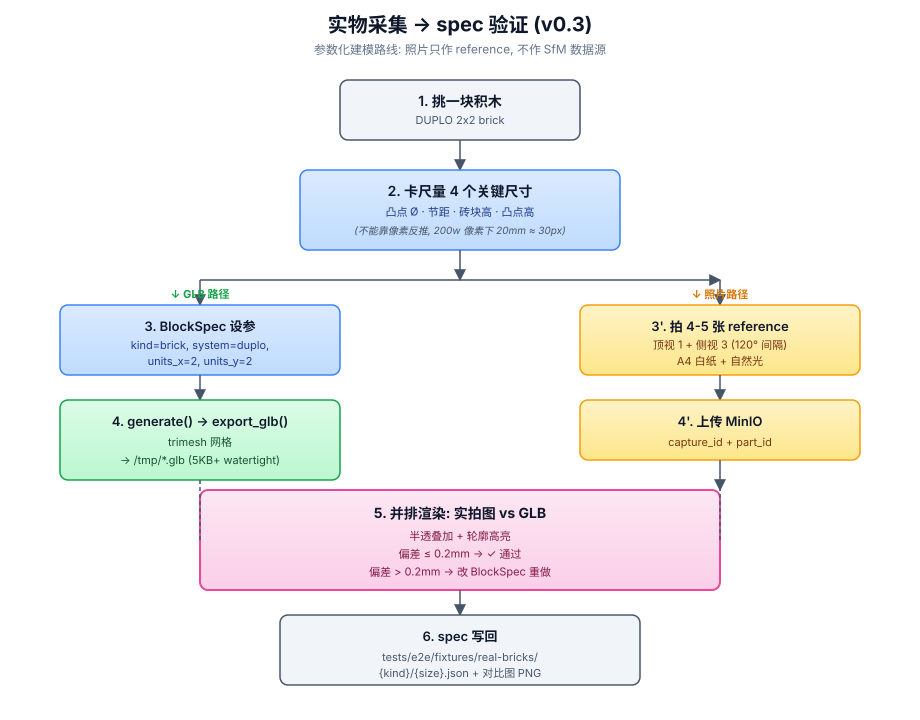
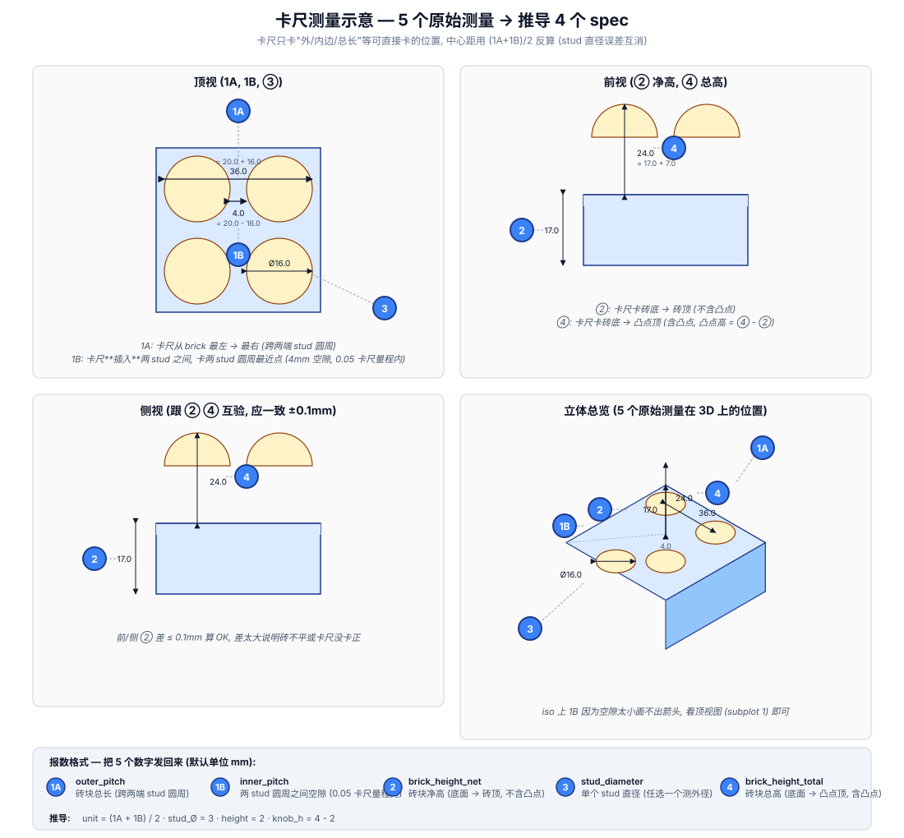
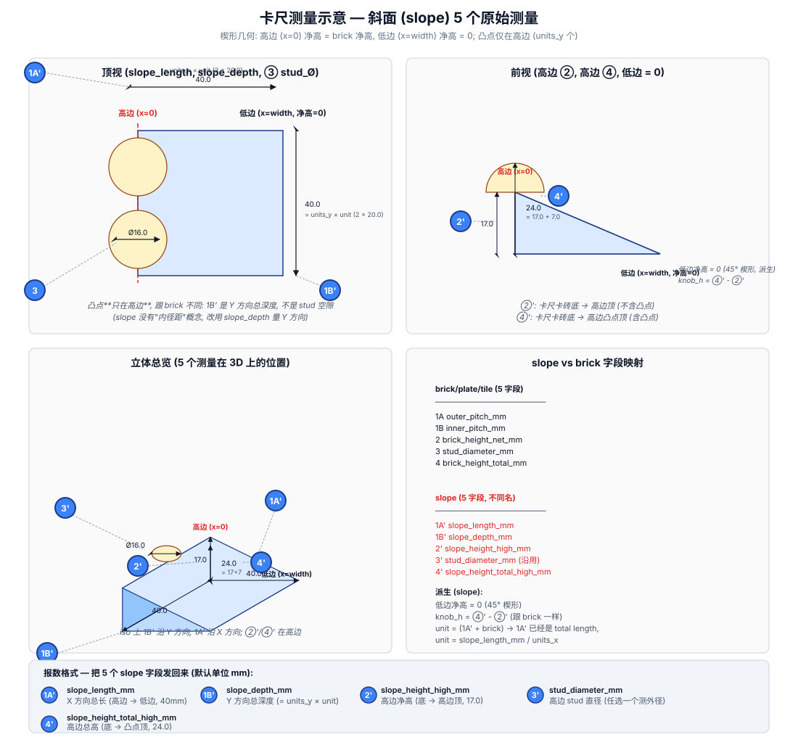

# 实物采集流程 (v0.3 + v0.4 阶段)

> v0.3 核心变化: **从"拍照 → SfM 反推" 切到"拍实物 → 对比验证 spec"**。模型由 BlockGenerator 参数化生成, 照片只用来证明"生成的 GLB 跟手里的实物一样"。
>
> v0.4 增量: 把上面 CLI / 离线流程搬到浏览器 (`/parametric` 4 步 wizard), 跟"卡尺 + 文件夹"路径**并列**, 共享同一份 5 字段 + 同一份 BlockSpec。详见 §5。

## 1. 当前采集流程



> 流程图 SVG 源文件: `docs/capture-procedure.svg` (可拖到浏览器看大图, 也可改完用 `mavis mcp call matrix upload_to_cdn` 转发)。

**双路径结构**:
- **左路 (绿/蓝)**: 卡尺量 4 个关键尺寸 → 写 `BlockSpec` → `generate()` → `export_glb()` → `/tmp/*.glb`
- **右路 (黄)**: 拍 4-5 张 reference 照片 → 上传 MinIO
- **合流 (粉)**: 实拍图 vs GLB 并排渲染, 偏差 ≤ 0.2mm 通过, 否则改 `BlockSpec` override (`unit_mm=...` 之类) 重做
- **沉淀 (灰)**: 通过的 spec 写回 `tests/e2e/fixtures/real-bricks/{kind}/{size}.json`

**关键点**:
- 拍 4-5 张就够, **不再追求 13 张 / 多角度 baseline** (那是 v0.2 SfM 思路)。
- 4 个核心尺寸必须卡尺量, **不能靠像素反推** (DUPLO 20mm 节距在 200w 像素图上 ~30 像素, 精度不够)。
- spec 跟 spec 不齐: 用手里的实物改 `BlockSpec` 的 override (`unit_mm=...`), 不改 `LEGO_UNIT_MM` 这些公开常量。
- 并排渲染输出到 `docs/validation/{part_id}-side-by-side.png`, 跟 GLB 一起 commit, **当 spec 验证的可视化证据**。

## 1.1 测量示意 (4 个核心尺寸)

量之前先看这张图, 5 个编号对应 5 个**卡尺可直接卡**的原始测量（不是 4 个 spec 中心距——中心距量不准, 改成外径+内径反算）:



- **1A** `outer_pitch_mm` — 砖块总长 (跨两端 stud 圆周, 大尺寸好量)
- **1B** `inner_pitch_mm` — 两 stud 圆周之间空隙 (4mm 量程内, 0.05 卡尺可量)
- **②** `brick_height_net_mm` — 砖块净高 (底面 → 砖顶, 不含凸点)
- **③** `stud_diameter_mm` — 单个 stud 直径 (任选一个测外径)
- **④** `brick_height_total_mm` — 砖块总高 (底面 → 凸点顶, 含凸点)

**斜面 (slope)** 几何特殊 — 高边 (x=0) 净高 = brick 净高, 低边 (x=width) 净高 = 0, 凸点只沿高边。字段名跟 brick 不同, 见 `docs/measure-block-slope.svg`:



- **1A'** `slope_length_mm` — X 方向总长 (高边 → 低边)
- **1B'** `slope_depth_mm` — Y 方向总深度 (slope 没有"内径距"概念, 改用总深度)
- **2'** `slope_height_high_mm` — 高边净高
- **3'** `stud_diameter_mm` — 高边 stud 直径 (沿用 brick 的字段名)
- **4'** `slope_height_total_high_mm` — 高边总高
- **派生**: 低边净高 = 0 (45° 楔形), `knob_h = ④' - ②'`

**推导**（`tools/measure_block.py` 自动算, 不用手算）:

| BlockSpec 字段 | 公式 | 来源 |
|---|---|---|
| `unit_mm` | `(1A + 1B) / 2` | stud_Ø 误差互消 |
| `knob_diameter_mm` | `③` | 直接用 |
| `height_mm` | `②` | 直接用 |
| `knob_height_mm` | `④ - ②` | 总高 - 净高 |

**冗余校验**: `stud_diameter_mm` 跟 `(1A - 1B) / 2` 应一致, 差 > 0.5mm 自动报警 (说明 1B 量错了)。

量完把 5 个数字发回来, 格式任选 (默认单位 mm):

```
1A=36.05
1B=3.95
2=17.02
3=16.10
4=24.05
```

或一句话:

```
1A=36.05, 1B=3.95, 2=17.02, 3=16.10, 4=24.05
```

拿到数字我跑 `tools/measure_block.py` 出 GLB + spec.json + 3-view preview, 如果校验通过会显示 "derived unit_mm = 20.000", 不通过会出 ⚠。

## 2. 采集设备建议

| 设备 | 用途 | 替代方案 |
|---|---|---|
| 游标卡尺 (0.05mm 精度) | 4 个核心尺寸 | 直尺 (只能验 brick h) |
| 手机 (iPhone 14+) | 顶视 + 侧视 4 张 | DJI Osmo Pocket 3 |
| 拍摄环境 | 自然光 + A4 白纸当背景, 阴影角度 30-45° | — |

不需要: 转盘 / 测距仪 / 校色卡 (这些是 SfM 用的, 我们不做 SfM)。

## 3. 进度跟踪

| 实物 | kind | system | size | 卡尺 | 4 照片 | GLB | 对比图 | spec.json |
|---|---|---|---|---|---|---|---|---|
| DUPLO 2x2 brick | brick | duplo | 2x2 | ⬜ | ✅ 13 张 | ✅ 9.5KB | ⬜ | ⬜ |
| LEGO 2x4 brick | brick | lego | 2x4 | ⬜ | ⬜ | ✅ | ⬜ | ⬜ |
| DUPLO 2x2 plate | plate | duplo | 2x2 | ⬜ | ⬜ | ✅ | ⬜ | ⬜ |
| DUPLO 2x2 tile | tile | duplo | 2x2 | ⬜ | ⬜ | ✅ 10KB | ⬜ | ⬜ |
| DUPLO 2x2 slope | slope | duplo | 2x2 | ⬜ | ⬜ | ✅ | ⬜ | ⬜ |
| ... | | | | | | | | |

## 4. 如果照片显示跟 GLB 不一致

按下面顺序排查:

1. **网格朝向** — 默认 brick 底面在 Z=0, 顶面在 Z=height+knob_h。Three.js 加载时注意相机 up vector。
2. **stud 间距** — `BlockSpec.units_x × unit_mm` 算出来对不对。比如 2x2 DUPLO = 40×40×17mm, 不是 32×32 (那是错把 unit 当 16)。
3. **拍照缩放** — 并排渲染时把照片缩到 GLB 的 bbox 框大小, 不要按原图大小对齐。
4. **spec 漂移** — 手里这批货可能跟 LEGO.com 公开规格有 ±0.2mm 偏差, 用 `BlockSpec(unit_mm=19.8)` 之类 override, **别改 `LEGO_UNIT_MM` / `DUPLO_UNIT_MM` 常量**。

## 5. App 端 (v0.4 `/parametric` 4 步 wizard)

> 跟前面 §1-§4 的"卡尺 + 文件夹"路径**并列**的浏览器端流程。两条路径共享同一份 5 caliper 字段、同一份 `BlockSpec`、同一份 `BlockGenerator` 几何生成代码, 唯一区别是"用户在哪一步把 5 数字报回来"。

### 5.1 何时用 App 端 vs CLI 端

| 场景 | 推荐路径 |
|---|---|
| 在桌前, 电脑 / 手机浏览器, 想要即时预览 GLB | **App 端** (`/parametric`) |
| 在车间 / 没有浏览器的环境, 卡尺量完先存档 | **CLI 端** (`tools/measure_block.py` + 落盘 `*.json` + `*.glb`) |
| 想批处理多个 brick (e.g. 一盒 DUPLO 全部入库) | **CLI 端** + 写一个 shell 循环调 `--config` |
| 想跟生成 GLB 并排对齐 (实物校准的视觉产物) | **App 端** (步骤 4 走完直接出 R3F viewer) |
| 想给非技术用户演示 | **App 端** (表单 + 实时校验 + 失败提示) |

### 5.2 4 步流程对照

| 步骤 | App 端 (`/parametric`) | CLI 端 (`tools/measure_block.py`) |
|---|---|---|
| 1. 准备 | 浏览器打开 `/parametric` | 准备 JSON config 或 CLI 参数 |
| 2. 选体系/类型/尺寸 | 表单 (system / kind / units_x × units_y) | `--system duplo --kind brick --units-x 2 --units-y 2` |
| 3. 输入 5 数字 | 5 个 number input + 卡尺示意 SVG, 前端实时校验 (`crossCheckMeasurements`) | `--outer-pitch-mm 35.95 --inner-pitch-mm 4.05 --stud-diameter-mm 16.10 --brick-height-net-mm 17.05 --brick-height-total-mm 24.10` |
| 4. 提交 + 预览 | "下一步" 触发 `POST /api/v1/parametric-blocks` + SSE 5 步 ladder + R3F 加载 GLB | 跑 `tools/measure_block.py --config examples/...` 出 `*.glb` + `*.json` + 3-view `*-preview.png` |
| 5. 验证 | 实物照片 vs GLB 在浏览器并排 (步骤 4 viewer 区域内) | `tests/e2e/fixtures/real-bricks/{kind}/{size}.json` + `docs/validation/{part_id}-side-by-side.png` |

### 5.3 字段名一致性契约 (跨 4 处)

5 个 caliper 字段的 key 在 4 个位置**必须保持一致** (都以 `_mm` 结尾):

| 位置 | 路径 / 引用 |
|---|---|
| 前端 schema | `apps/web/src/features/parametric/schema.ts:MEASUREMENT_FIELDS[*].key` |
| 前端 API client | `apps/web/src/features/parametric/api.ts` (POST FormData `raw_measurements_mm` JSON 编码) |
| 后端路由校验 | `apps/api/src/api/v1/parametric_blocks.py:_RAW_KEYS` |
| CLI argparse | `tools/measure_block.py --outer-pitch-mm ...` |
| 数据库 | `captures.raw_measurements_mm` JSONB 字段, key 同上 |

后端 `_derive_spec_from_raw` / `_cross_check_raw` 是 `tools/measure_block.py` `derive_spec_from_raw` / `cross_check_raw` 的**等价 3 行复制** (API 不能 import `tools/`, 因为 `tools/` 不在 `apps/api` 的 import path 上)。两边数字必须永远一致, 改一边要同步改另一边。

### 5.4 端到端时序 (App 端, 5 步 SSE ladder)

```
浏览器                       FastAPI                       Celery worker
  |  POST /parametric-blocks    |                              |
  |  (multipart: 5 数字 + 0-20  |                              |
  |   照片)                     |                              |
  |---------------------------->|                              |
  |                             |  201 Created                 |
  |                             |  {capture_id, job_id,        |
  |                             |   derived_spec_mm,           |
  |                             |   cross_check_warnings}      |
  |<----------------------------|  (UI 进入步骤 4, 订阅 SSE)   |
  |                             |                              |
  |  GET /jobs/{id}/stream      |                              |
  |---------------------------->|--- reconstruct.apply_async ->|
  |                             |                              |  if mode=='parametric_block':
  |                             |                              |     skip collecting_photos
  |                             |                              |     BlockSpec → generate()
  |                             |                              |     export_glb() → MinIO
  |                             |                              |     update capture.status=completed
  |  event: progress            |                              |
  |  data: {stage:'prepare'}    |<-----------------------------|
  |<----------------------------|                              |
  |  event: progress            |                              |
  |  data: {stage:'generate'}   |<-----------------------------|
  |<----------------------------|                              |
  |  event: completed           |                              |
  |  data: {result_asset_id}    |<-----------------------------|
  |<----------------------------|                              |
  |  R3F Viewer 加载 GLB        |                              |
```

完整 worker 分支见 `apps/api/src/workers/tasks/reconstruct.py:_run_parametric_pipeline`; 复用拍照路径的 `_finalize_mesh_pipeline` 写 MinIO + 更新 DB。

### 5.5 失败 / 校验不通过时怎么修

| 现象 | 原因 | 修法 |
|---|---|---|
| 提交后 422 "missing keys" | 5 字段没填全 | App 表单没填的数字回步骤 3 补全; CLI 补 `--*-mm` 参数 |
| 步骤 3 黄色警告 "凸点直径反算 X.XX mm 跟填写 X.XX mm 差 > 0.5 mm" | `1B` 错位, 跟 `1A` `3` 不一致 | 卡尺重新卡两 stud 之间, 重点看 0.05 量程内读数 |
| 步骤 4 "模型加载失败 HTTP 422" | 字段名错 (e.g. `outer_pitch` 漏了 `_mm`) | 检查后端 `_RAW_KEYS` 列表, 严格使用 `outer_pitch_mm` 形式 |
| 步骤 4 ladder 卡在 "准备生成" | 后端 5xx / worker 死了 | 看 FastAPI 日志 + Celery worker 日志; App 步骤 4 有 "重试提交" 按钮 |
| 步骤 4 完成后 GLB 跟实物对不上 | 同 §4 的 4 条排查 (网格朝向 / stud 间距 / 拍照缩放 / spec 漂移) | App 端直接回步骤 3 改 5 数字, 重提; CLI 端改 `--*-mm` 重跑 |
| 步骤 1 上传 HEIC 失败 | 后端缺 `pillow-heif` 注册 | docker 镜像补一行 `apt install libheif-dev && pip install pillow-heif` (跟 v0.2 一样) |

### 5.6 跟 CLI 端的产物差异

| 产物 | App 端 | CLI 端 |
|---|---|---|
| GLB 网格 | ✅ 上传 MinIO, 通过 `assets/{id}` URL 拉取, R3F viewer 渲染 | ✅ 落盘到 `--output-dir`, 路径在终端打印 |
| spec JSON | ✅ `derived_spec_mm` 在 201 响应里 + `cross_check_warnings` | ✅ `{part_id}.json` 落盘 (含 `public_spec_mm` 对比 + `deviation_from_public_mm`) |
| 3-view 预览 PNG | ❌ (用 R3F viewer 替代, 交互式 360° 旋转) | ✅ `{part_id}-preview.png` 落盘 |
| 实物校准并排渲染 | 🟡 (R3F viewer 区域可手动截图) | 🟡 走 `docs/validation/{part_id}-side-by-side.png` 流程 (跟 v0.3 一样) |

### 5.7 完整用户文档

App 端 4 步 wizard 的截图引用 / 字段适用性表 / "卡尺友好" 原则 / FAQ / 实现位置速查, 见 **`docs/parametric-block-guide.md`** (v0.4 新增用户指南)。
